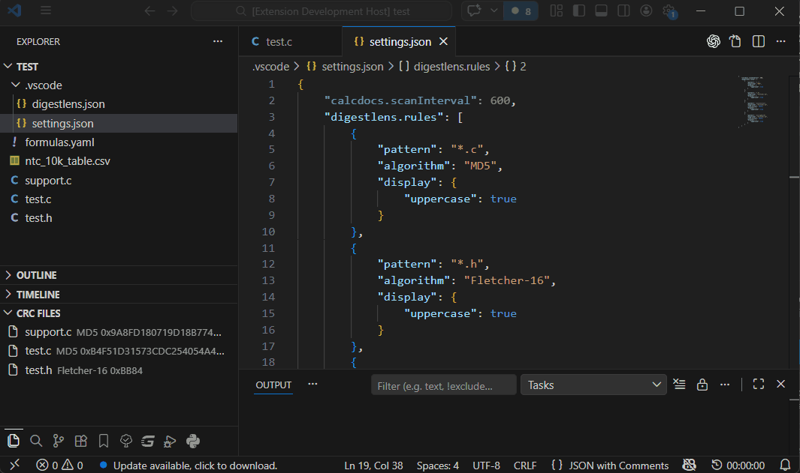
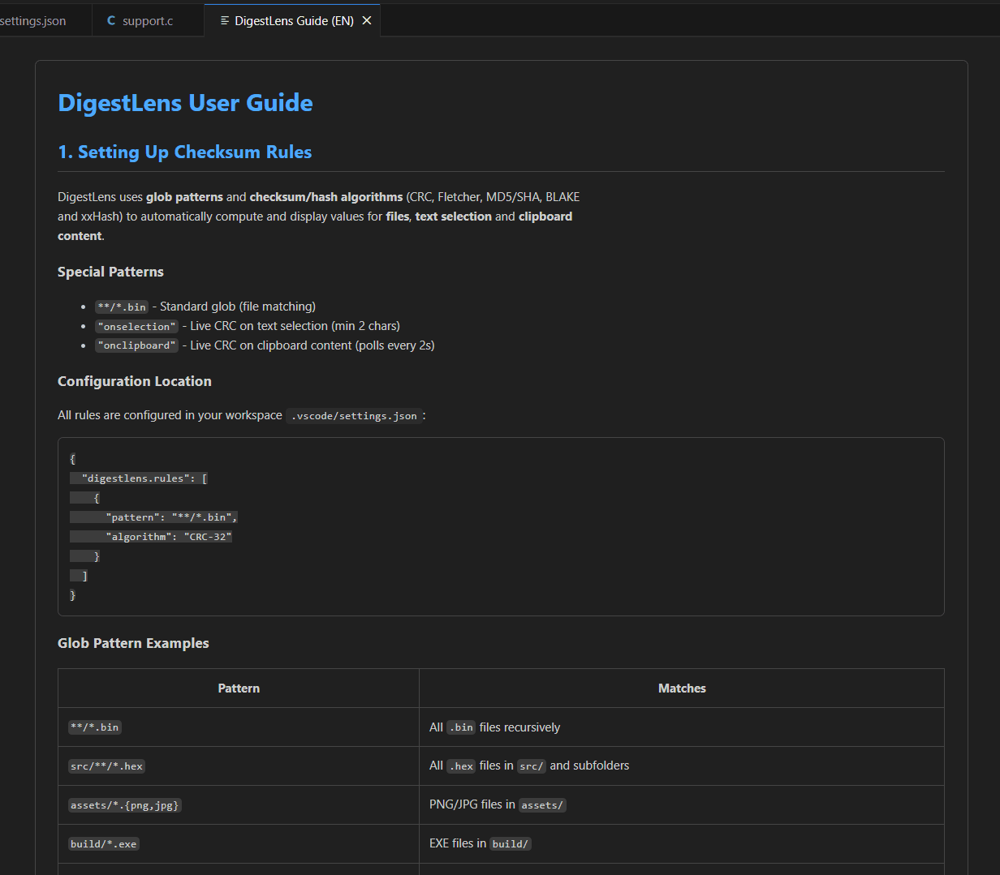
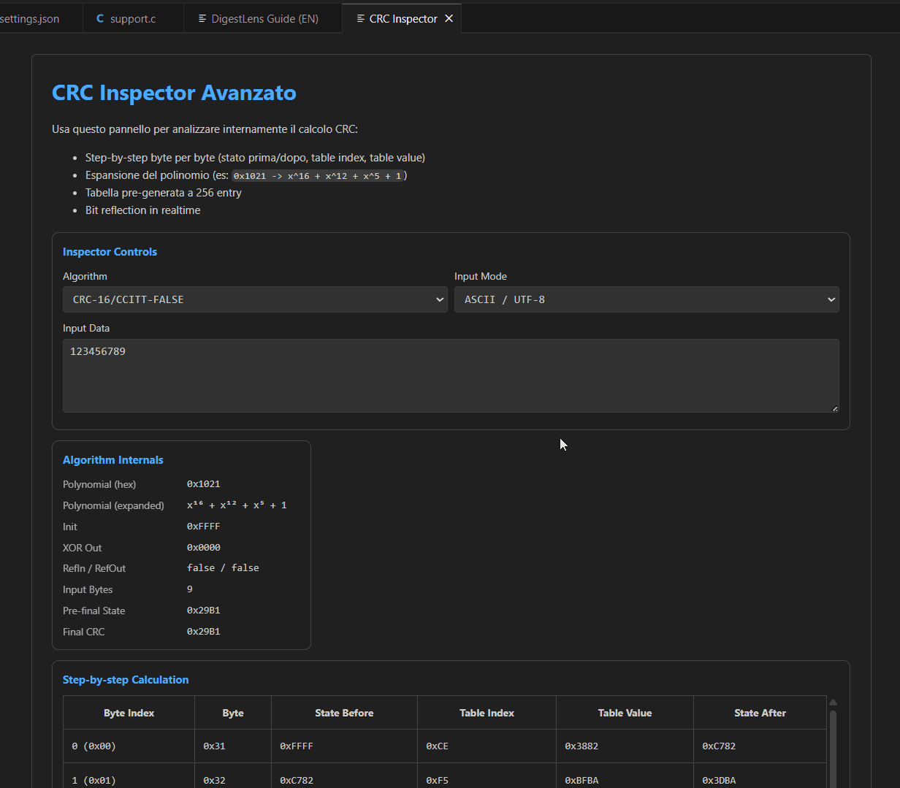

# Digest Lens - CRC & Hash Lens – Checksum Viewer  
[](https://marketplace.visualstudio.com/items?itemName=convergo-dev.digestlens) [](https://marketplace.visualstudio.com/items?itemName=convergo-dev.digestlens) [](https://marketplace.visualstudio.com/items?itemName=convergo-dev.digestlens)

> 🚀 The fastest way to compute *CRC, hashes, and checksums in VS Code* — live, inline, zero friction.

**DigestLens** is a powerful CRC / Hash / Checksum extension for VS Code that automatically calculates and displays digests (CRC32, SHA256, BLAKE3, xxHash…) directly in your workflow.

- ✔ No manual tools  
- ✔ No context switching  
- ✔ Just instant visibility  

**DigestLens** calcola e visualizza automaticamente i checksum/hash (CRC, Fletcher, SHA, BLAKE3, xxHash) sui tuoi file direttamente nell'Explorer di VS Code.

## 🔥 Why Developers Love DigestLens

- ⚡ Real-time CRC & hash calculation  
- 👁 Inline Explorer badges (see checksums at a glance)  
- 🧠 Smart caching = blazing fast  
- 🧩 Works with any file via glob rules  
- 🛠 Advanced CRC customization (full control)  


| Feature | Descrizione |
|---------|-------------|
| **Explorer Checksum Badges** | Instantly see CRC / hash next to your files |
| **Hover Tooltips (Full Digest)** | View complete checksum + algorithm details |
| **Live Status Bar** | Always know the hash of your active file |
| **Dedicated Digest View** | Explore all matching files in a structured tree |
| **Selection & Clipboard Hashing** | Compute hashes from: selected text (onSelection) and clipboard (onClipboard) |
| **19+ Algorithms Supported** | CRC32, CRC16, CRC8, CRC32C, Fletcher-8/16, MD5, SHA-1, SHA-256, SHA-512, BLAKE2, BLAKE3, xxHash32/64 ➕ Custom CRC (fully configurable) |
| **Advanced Glob Rules Engine** | Target exactly the files you need |
| **CRC Inspector (Debug Mode)** | Step-by-step breakdown with: lookup tables, polynomial tracing and internal state visibility |

## 🖼 Preview

### Digest-Lens Demo

  

---

### Guide Preview

  

---

### Inspector Preview

  

## 🚀 Install in *seconds*

👉 [marketplace.visualstudio.com/items?itemName=convergo-dev.digestlens](https://marketplace.visualstudio.com/items?itemName=convergo-dev.digest-lens)

1. Open *VS Code Extensions*
2. Search *CRC / Hash / Checksum*
3. Install *DigestLens*

## ⚙️ Quick Start (30 seconds)

Add this to your `.vscode/settings.json`:

```json
{
  "digestlens.rules": [
    {
      "pattern": "**/*.{bin,hex}",
      "algorithm": "CRC-32"
    },
    {
      "pattern": "src/**/*.js",
      "algorithm": "xxHash64",
      "display": { "uppercase": true }
    },
    {
      "pattern": "onSelection",
      "algorithm": "Fletcher-16"
    }
  ]
}
```

## 🧠 Use Cases

- Firmware validation (CRC checks)
- File integrity verification
- Reverse engineering workflows
- Embedded systems development
- Security & hashing pipelines
- Debugging binary protocols

## 📚 Documentation

Full guide → [User Guide](l10n/guide_en.md)  

Includes:
- all algorithms
- custom CRC setup
- glob recipes
- troubleshooting

## 🧑‍💻 Contribute / Feedback

[Repository GitHub](https://github.com/mik1981/Digest-Lens-VSCode-Ext) | [Issues](https://github.com/mik1981/Digest-Lens-VSCode-Ext/issues)

Your feedback drives the evolution of this extension 🚀  

Have an idea, missing feature, or improvement in mind?  
Don't keep it to yourself — let’s build it together.  

### 💡 Ways to contribute

- ⭐ Star the repository to support the project  
- 🐛 Report bugs or unexpected behavior  
- 💬 Suggest new features or improvements  
- 🔧 Propose new digest/CRC algorithms  
- 📦 Submit a pull request and contribute directly  

### 📬 Direct contact

If you’d like to propose new algorithms or discuss advanced use cases, feel free to reach out:  
📧 `caludia@tiscali.it` (subject: `DigestLens`)

### 🚀 Quick start for contributors

```bash
git clone https://github.com/mik1981/Digest-Lens-VSCode-Ext.git
npm install
npm run compile
```

## 📄 Licenza

[](./LICENSE.md)

---

⭐ **Install *DigestLens* now and make checksums invisible work!**

